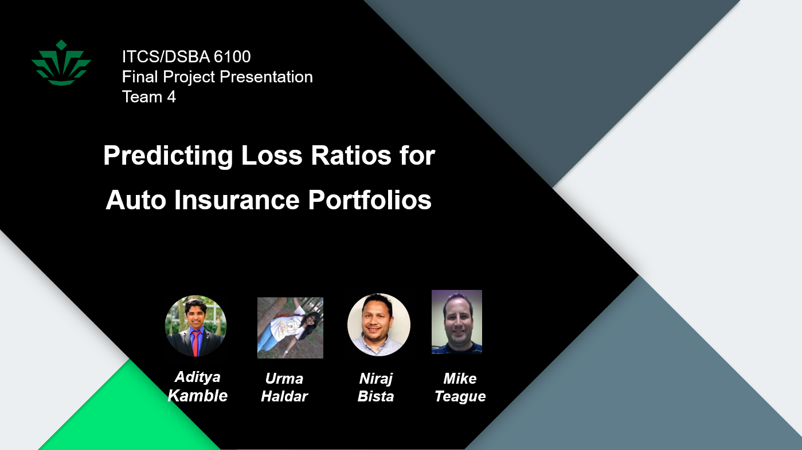
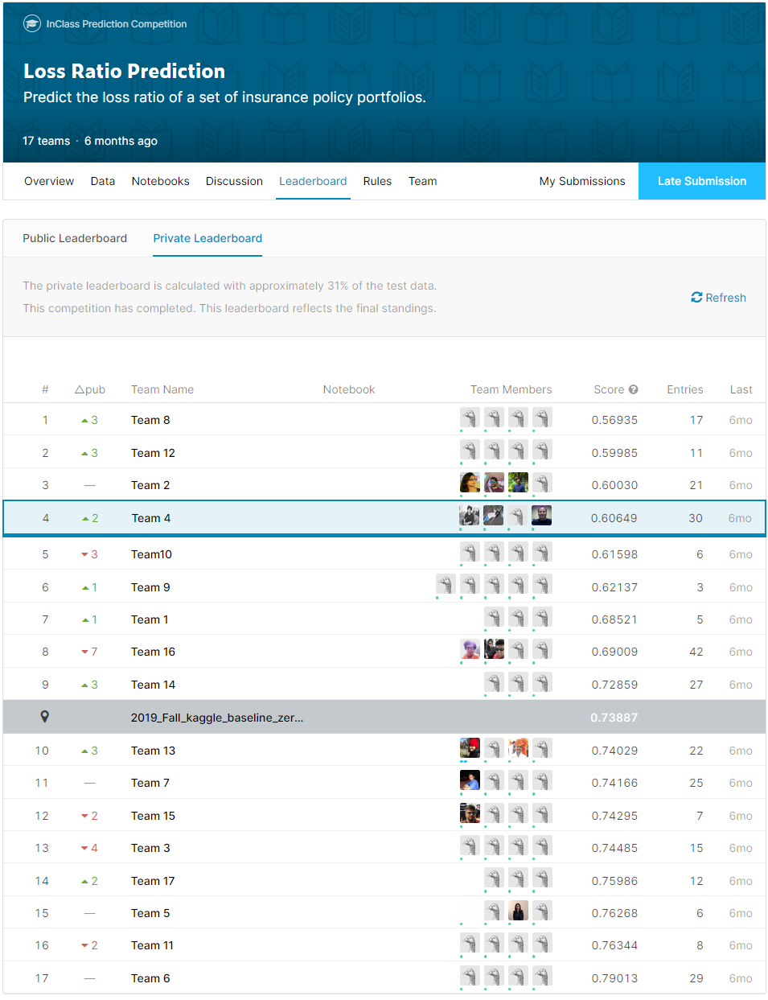

# Loss Ratio Prediction - Auto Insurance Portfolios

## Team Members

[Aditya Kamble](https://www.linkedin.com/in/adityakamble49/), [Urma Haldar](https://www.linkedin.com/in/uhaldar/), [Niraj Bista](https://www.linkedin.com/in/niraj-bista/), [Michael Teague](https://www.linkedin.com/in/michael-teague-a37b766/)

## Description

Predicting Loss Ratios for Auto Insurance Portfolios

The goal of this project is to predict the natural logarithm of the loss ratio of a portfolio of auto insurance policies. The testing data contains a set of 330 policy portfolios, each having at least 1,000 auto policies.

The training data contains of a set of auto policies including a number of policy level attributes as well as Annual Premium and Loss Amount.

The Loss Ratio of a policy is just the Loss Amount divided by the Premium.

The Loss Ratio of a portfolio of policies is the sum of all the Loss Amounts of all the policies in the portfolio divided by the sum of all the Premiums in the portfolio.

Your target is the natural logarithm of the the loss Ratio of a portfolio.

## Implementation

Predict the loss ratio of a set of insurance policy portfolios. 
(ITCS-6100 Big Data Analytics - https://www.kaggle.com/c/lossratio/overview)

- Calculated impact of each feature on loss amount and performed through Exploratory Data Analysis using Matplotlib & Seaborn to select important features for modelling.
- Implemented rigorous feature engineering by grouping multiple policies into portfolio and creating useful features using aggregation which improved MAE by 0.90 and accuracy by 40%

## Presentation

## Results

